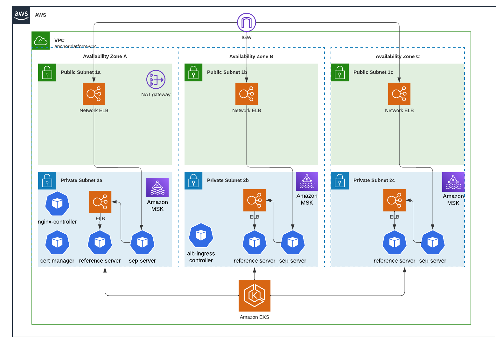

# Terraform Cloud, EKS, Kubernetes, Helm with Kafka Event Queue (AWS MSK)
This documentation will configure AWS Infrastructure, Anchor Platform and a sample Receiving Anchor Application. Once deployed you can run the Anchor Validator tool to verify SEP-31 Compliance. The following will be deployed via Terraform:
- Network
  - [AWS VPC and Subnets](terraform/vpc.tf)
  - Public and Private Subnets
  - Security Groups
  - [Route53 Hosted Zone](terraform/route53.tf), including Public and Internal CNAMES
- Kubernetes
  - [Amazon EKS](terraform/eks-cluster.tf) Cluster
  - [Nginx Public Ingress Controller](terraform/nginx-release.tf) (ELB for SEP Server)
  - [AWS Load Balancer Controller Add-on](terraform/internal-aws-lb-controller-release.tf_)] (internal ELB for Reference Server) 
  - [Helm Charts for Anchor Platform](terraform/anchor-platform-sep-server-release.tf)] Kubernetes (Sep Server) deployment
  - [Helm Charts for Reference Server](terraform/anchor-platform-reference-server-release.tf) (Receiving Anchor Sample Application) 
  - [Cert-Manager](terraform/anchor-platform-cert-manager.tf) and LetsEncrypt front-end certificate
- Event Queue
  - [Amazon MSK Cluster](terraform/kafka.tf) for event notification 

 

# Steps
- Pre-requisites
   - Fork the [stellar-java-anchor-sdk](https://github.com/stellar/java-stellar-anchor-sdk_) github repository
   - Create AWS Account and IAM account with deployment permissions
   - Create DNS Hosted Zone for Anchor Platform with public DNS
   - Configure Terraform Cloud Account and Workspace with VCS connection to forked [java-stellar-anchor-sdk](https://github.com/stellar/java-stellar-anchor-sdk)
   - Configure Workspace Variables
    - Setup Workspace variables `AWS_SECRET_ACCESS_KEY` and `AWS_ACCESS_KEY_ID`
    - Add `hosted_zone_name` Variable with ARN of your pre-configured DNS hosted zone.
- Deploy Anchor Platform Example
   - Run Terraform Plan
   - Run Terraform Apply
- Run [Stellar Anchor Validation Tool][https://anchor-tests.stellar.org/) to verify your deployment.

# Known Issues
Known issues are tagged with [label:example-eks](https://github.com/orgs/stellar/projects/24/views/5?filterQuery=label%3A%22example-eks%22_).
